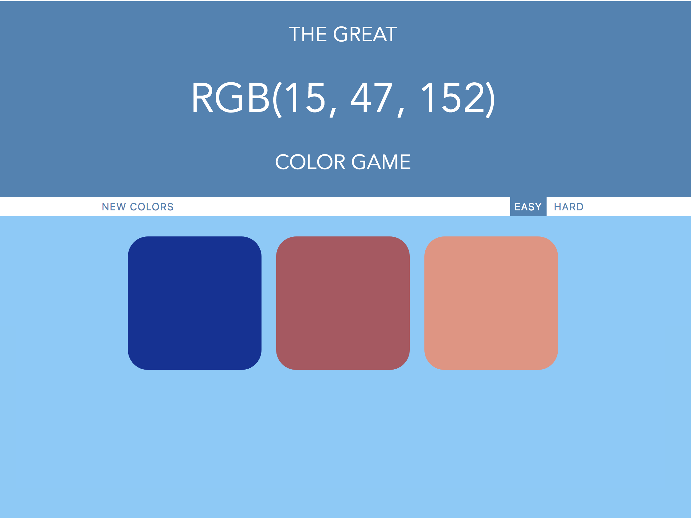
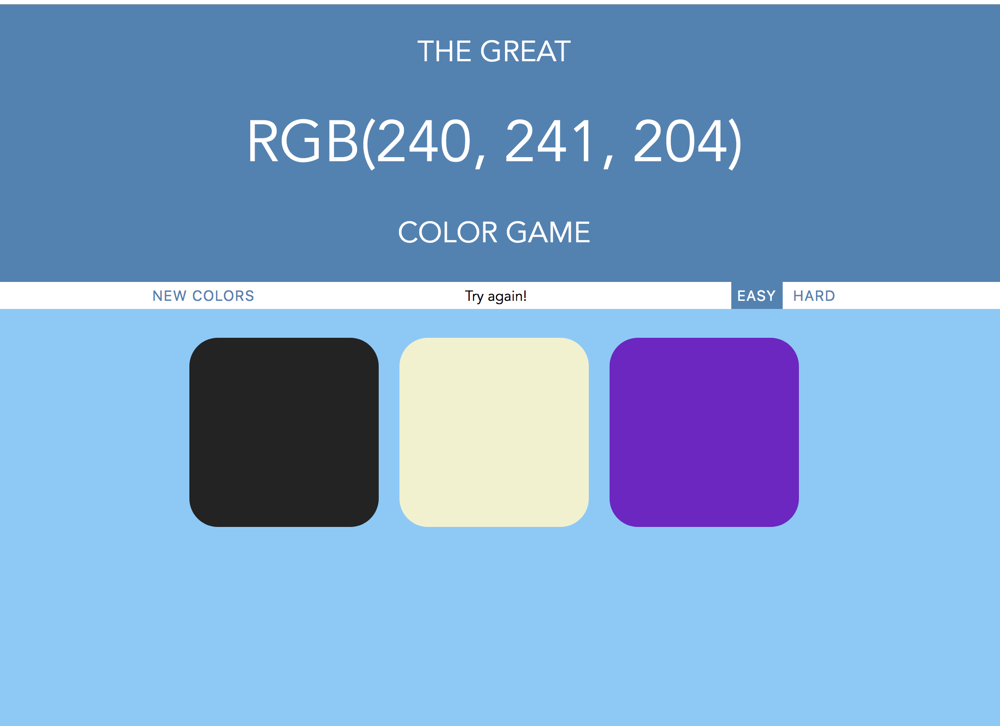
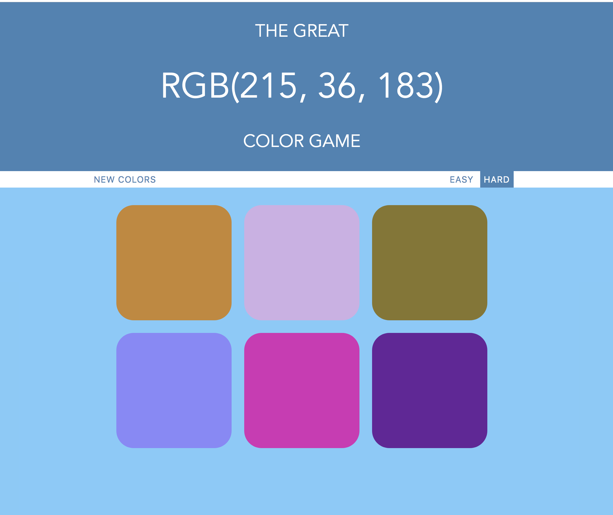

The Great Color Game.

The project was created for guessing color in RGB.

The project goal is to look at an RGB number and guess the corresponding color correctly.

Installing
Step 1: Copy the Repository
Step 2: In command line, git clone the repository
Step 3: CD into your repository
Step 4: Open the colorGame.html file in the browser, either from the editor or copy and paste the path of the file into the browser
Step 5: The game should be displayed and ready for execution

Getting Started
1. Once you have the file open in the browser you'll be able to play the game.
2. Choose one of 2 difficulty levels : easy or hard
3. Look at the RGB color number and try to guess which color it is by clicking on the colored square
4. If you guess incorrectly, try again with a new color
5. To play a new game, click "PLAY AGAIN!"
6. Good luck!

#### Sources

* [The Web Developer Bootcamp](https://www.udemy.com/course/the-web-developer-bootcamp/)
* [JavaScript Tutorial](https://www.w3schools.com/js/)
* [CSS Tutorial](https://www.tutorialspoint.com/css/index.htm)

Copyright © 2019 Regisha08